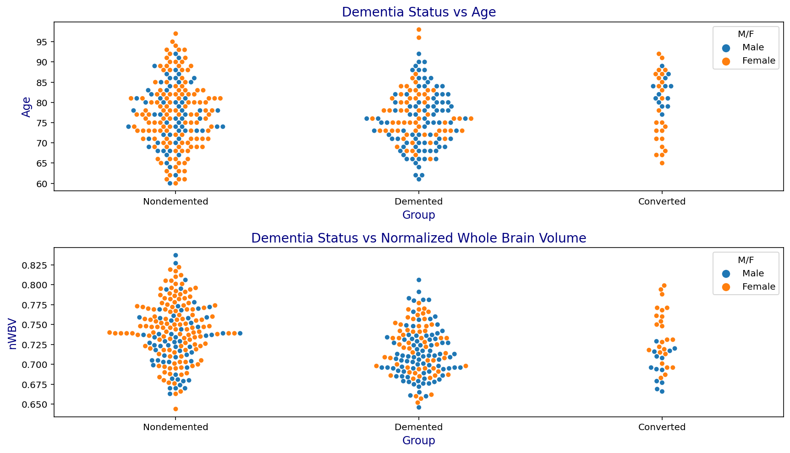

# Alzheimer's MRI Study
Here I identified how dementia diagnoses correlate with age and brain volume

```python
# read in the data

long = pd.read_csv('oasis_longitudinal.csv')
cross = pd.read_csv('oasis_cross-sectional.csv')
```
I converted the values of sex from M,F to Male,Female so the resulting plots would be more understandable

```python
#Convert M/F to Male,Female

dict = {'F':'Female', 'M':'Male'}
long['M/F'] = long['M/F'].replace(dict)
```

### Comparison of Age to Dementia Status and Brain Volume


```python
fig1 = plt.subplot(2,1,1)
sns.swarmplot(x='Group', y='Age', data=long, hue='M/F')
plt.title('Dementia Status vs Age', color='navy', size=14)
plt.xlabel('Group', color='navy', size=12)
plt.ylabel('Age', color='navy', size=12)


fig2 = plt.subplot(2,1,2)
sns.swarmplot(x='Group', y='nWBV', data=long, hue='M/F')
plt.title('Dementia Status vs Normalized Whole Brain Volume', color='navy', size=14)
plt.xlabel('Group', color='navy', size=12)
plt.ylabel('nWBV', color='navy', size=12)

plt.tight_layout()
plt.show()
```



