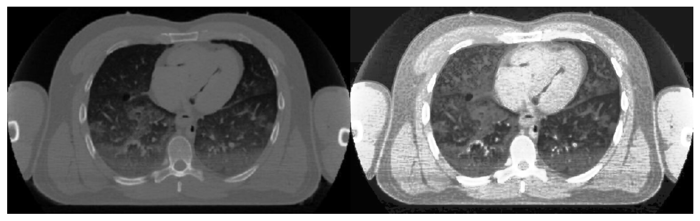

## Histogram Equalization of a CT Scan

```python
# read in image and convert to greyscale
orig = cv2.imread('CT_scan.jpg')
orig_grey = cv2.cvtColor(orig, cv2.COLOR_BGR2GRAY)
```

Because this image doesn't lend itself to global equalization, I converted it to a Contrast Limited Adaptive Histogram Equalization (CLAHE) object. I then used the CLAHE object to create a new image with better contrast than the original.
```python
# convert image to CLAHE object
clahe = cv2.createCLAHE(tileGridSize=(2,2))
orig_cl = clahe.apply(orig_grey)

# create new equalized image from the clahe original
new = cv2.equalizeHist(orig_cl)
```

Here is the original image (left), and the new image (right).
```python
# Stack the original image and new image side-by-side
res = np.hstack((orig_grey,new))
cv2.imwrite('res.png', res)
plt.imshow(res, cmap='gray')
plt.axis('off')
```


    

    
Note: code written in python

