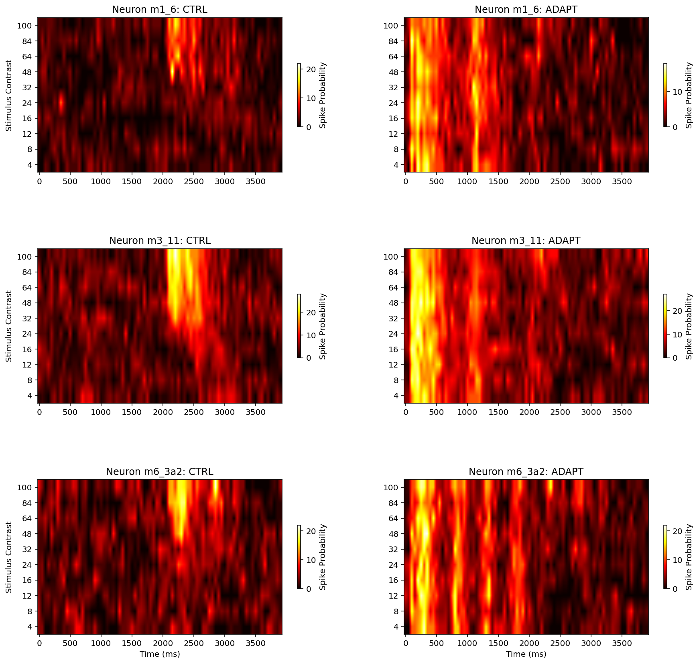

```python
fig = plt.figure(figsize=[15,15])
subplot_counter = 1 # used to track subplots

for neur in neuron_labels:
    for cond in cond_labels_2:
        ax = fig.add_subplot(len(neuron_labels), len(cond_labels_2), subplot_counter)
        aa = plt.imshow(psth_df3.loc[neur, cond], origin='lower', cmap='hot', interpolation='bilinear', aspect=5)
        
        cb = fig.colorbar(aa, shrink=0.33)
        cb.ax.set_ylabel('Spike Probability')

        # Nice formatting
        plt.title('Neuron ' + neur + ': ' + cond)

        xticks = range(0, len(time_bins), 10)
        plt.xticks(xticks,
                   time_bins[xticks])
        if neur == neuron_labels[-1]:
            plt.xlabel('Time (ms)')

        plt.yticks([x for x,y in enumerate(contr_labels)], 
                   [x for x in contr_labels])

        if cond == cond_labels[0]:
            plt.ylabel('Stimulus Contrast')
        subplot_counter += 1

plt.show()
```

