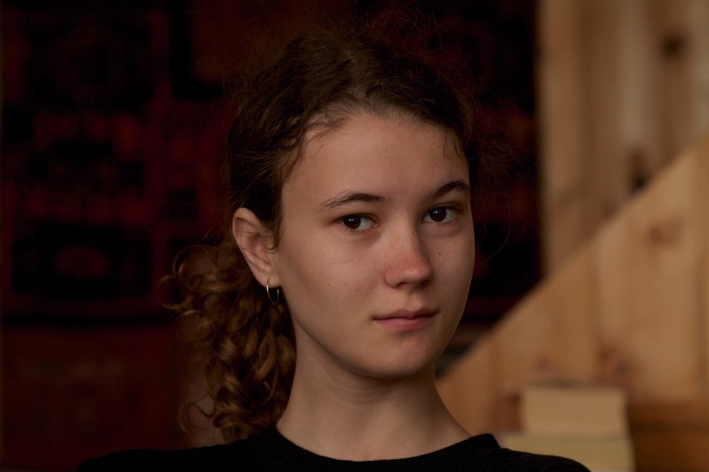

# Welcome 

Hello, and welcome to my professional coding portfolio! My name is Rory and I am a medical sciences student at Dalhousie University. I am an aspiring physician researcher with an interest in studying neurodegenerative diseases. I am a beginner coder learning the language Python. Here I have compiled some samples of my work to demonstrate my coding abilities. Enjoy! 

## Data Visualization:

[Swarm plot - dementia vs age, brain volume](Alzheimer's_MRI.md)

[Violin plot - fasting blood sugar vs age, cholesterol](FBS_vs_Age_and_Cholesterol.md)

## Statistical Analysis:

[Mean, standard deviation - creatinine vs sex, smoking habits](Heart_Failure.md)

[T test - student alcohol consumption](Student_Alcohol.md)

## Image Manipulation:

[Image histogram equalization - CT scan](CT_equalizing.md)

[Image masking - MRI](Image_masking.md)

[Statistical Mapping - fMRI](fMRI_stat_map.md)

## Contact me:
You can reach me via email at
[cr708761@dal.ca](mailto:cr708761@dal.ca)
