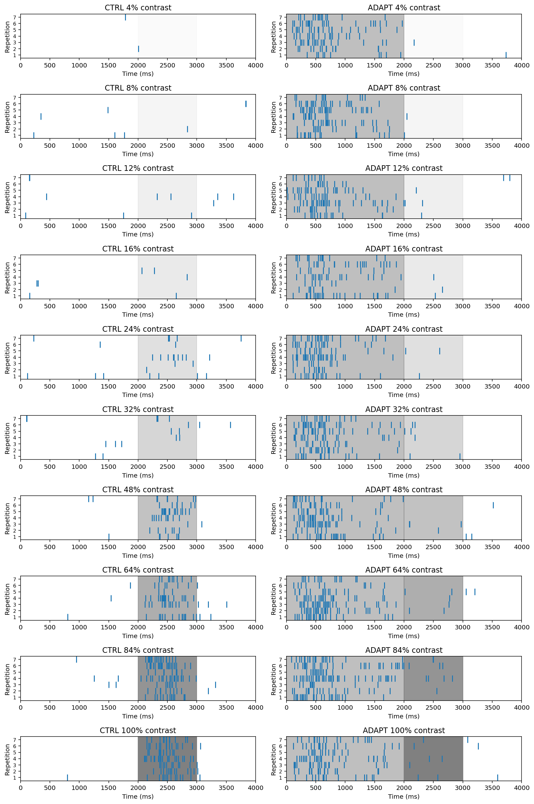

# Raster Plots for Visualization of Neuron Temporal Response Data

I started by reading in the data from a mouse primary visual cortex neuron, that was tested for its response to visual stimulation either after either a lack of stimulus (CTRL), or an adaptation stimulus (ADAPT).

```python
df = pd.read_csv('crowder_1_neuron.csv')
```
I then created raster plots showing the reaction data for each condition and contrast level.
```python

fig = plt.figure(figsize=[12,18])

subplot_counter = 1 # used to track subplots

for contr in contr_labels:
    for cond in cond_labels:

        ax = fig.add_subplot(len(contr_labels), len(cond_labels), subplot_counter)

        # Show adaptation grating at 50% contrast
        if cond == 'ADAPT':
            plt.axvspan(0, stim_on_time-1, alpha=0.5, color='grey')

        # Shading indicates stimulus on period
        plt.axvspan(stim_on_time, stim_off_time, alpha=contr/100, color='grey')

        for x in rep_labels:
            rep = x
            spike = df[(df['repetition'] == rep) & (df['contrast'] == contr) & (df['condition'] == cond) & (df['spike'] == 1)] 
            spike_times = pd.DataFrame(spike.iloc[:, 1])

            plt.vlines(spike_times, rep-1, rep);

        # Formatting
        plt.xlim([0, max(time_labels)+1])
        plt.ylim([0, len(rep_labels)])
        plt.title(cond + ' ' + str(contr) + '% contrast')
        plt.xlabel('Time (ms)')
        plt.ylabel('Repetition',)
        plt.yticks([x + 0.5 for x in range(num_reps)], [str(x + 1) for x in range(num_reps)], size=8) 
        plt.tight_layout()
        subplot_counter += 1
        
plt.show()

```


These plots showed a trend of increasing response times with increasing stimulus contrast, as well as a decreased response during the stimulus phase of the ADAPT condition, showing that the adaptation period had a negative effect on how strongly the neuron responded to the stimulus.

Note: code written in python; data courtesy of Dr. Nathan Crowder, Department of Psychology & Neuroscience, Dalhousie University.
