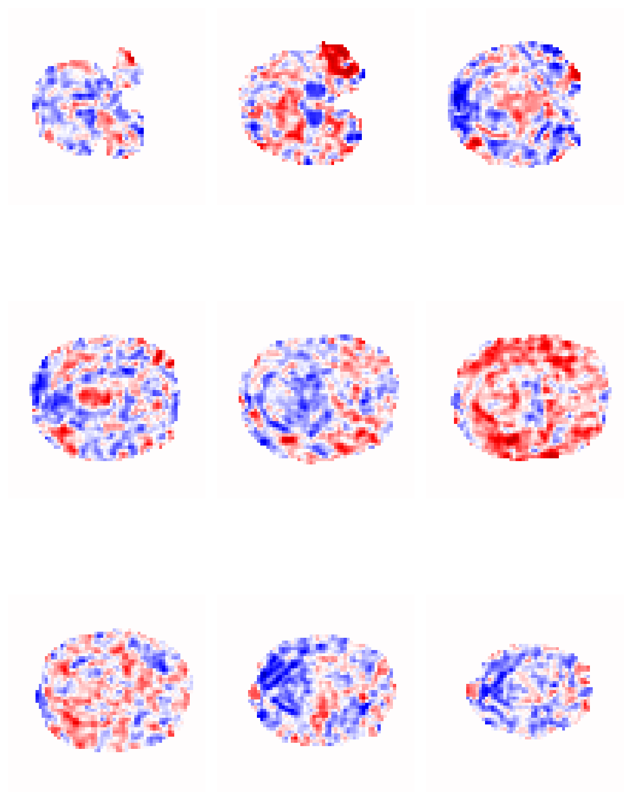
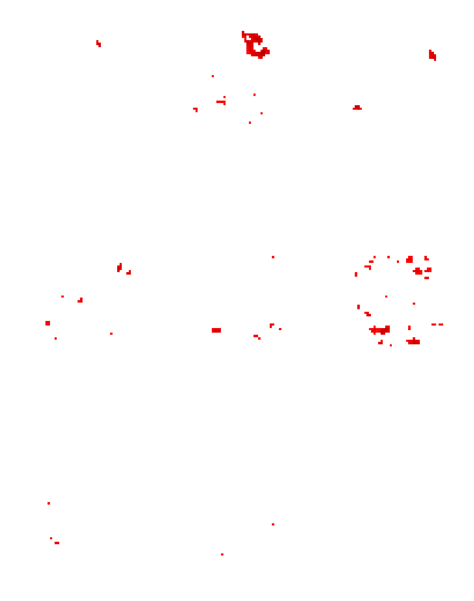
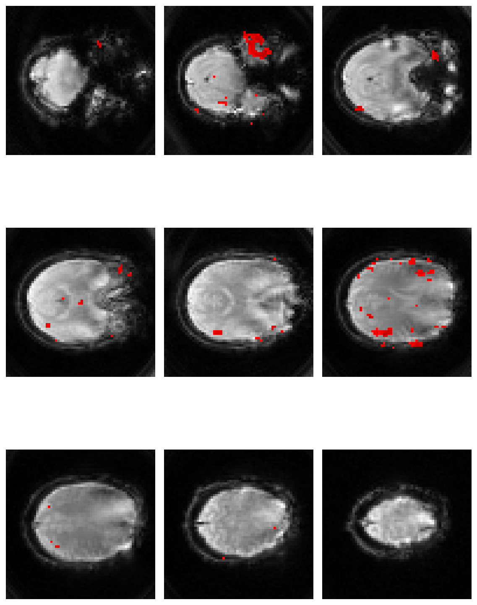

### Statistical Mapping of Experimental fMRI Data

I started by loading in a statistical Z map, the results of an analysis of a single fMRI scan from an experiment designed to activate area V5 of the visual cortex in response to an alternating pattern of moving and stationary visual stimuli.


```python
fmri_zstat = nib.load('V5_loc1_zstat1.nii.gz')
```

I then found the min and max Z values from the data to use in the image plotting in the next step.

```python
print('Max z value = ' + str(fmri_zstat_data.max().round(2)))
print('Min z value = ' + str(fmri_zstat_data.min().round(2)))
```

    Max z value = 8.05
    Min z value = -5.96

I plotted 9 slices through the image, and used the seismic colour map to make the positive and negative values more easily distinguishable from both each other and zero. I also set the value range to within the min and max Z values.

```python
fig = plt.figure(figsize=[8, 12])
subplot_counter = 1

for x in range(0, 27, 3):
    plt.subplot(3, 3, subplot_counter)
    im1 = fmri_zstat_data[:, :, x]
    plt.imshow(im1, cmap='seismic', vmin=-8, vmax=8)
    plt.axis('off')
    subplot_counter = subplot_counter + 1
plt.tight_layout()
plt.show()
```




To identify V5 and any other brain area that responds more strongly to moving than stationary stimuli, I set a threshold for the image to only show the Z scores above the statistical threshold of *p < .0001*.

```python
z_thresh = scipy.stats.norm.ppf(1 - .0001)
print(z_thresh)
```

    3.719016485455709

```python
fig = plt.figure(figsize=[8, 12])
subplot_counter = 1
thresh_zstat = np.where(fmri_zstat_data > z_thresh, fmri_zstat_data, np.nan)
for x in range(0, 27, 3):
    plt.subplot(3, 3, subplot_counter)
    im1 = thresh_zstat[:, :, x]
    plt.imshow(im1, cmap='seismic', vmin=-8, vmax=8)
    plt.axis('off')
    subplot_counter = subplot_counter + 1
plt.tight_layout()
plt.show()
```
    


I then overlaid the thresholded *Z* map on a greyscale version of the brain image. 


```python
# create underlay brain image
func = nib.load('V5_loc1_example_func.nii.gz')
underlay = func.get_fdata()

# combine Z map with underlay image
fig = plt.figure(figsize=[8, 12])
subplot_counter = 1
thresh_zstat = np.where(fmri_zstat_data > z_thresh, fmri_zstat_data, np.nan)
for x in range(0, 27, 3):
    plt.subplot(3, 3, subplot_counter)
    im1 = thresh_zstat[:, :, x]
    underlay1 = underlay[:, :, x]
    plt.imshow(underlay1, cmap='gray')
    plt.imshow(im1, cmap='seismic', vmin=-8, vmax=8)
    plt.axis('off')
    subplot_counter = subplot_counter + 1
plt.tight_layout()
plt.show()
```
    

    
The 6th slice (2nd row, 3rd column) shows area V5 in each hemisphere. These are the blobs of red nearer to the back of the head (left side of image) in each hemisphere. 

Note: this code was written in python
